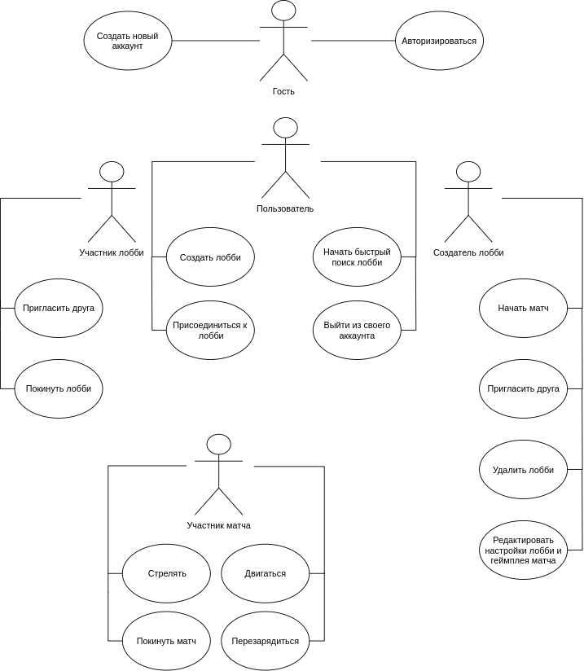
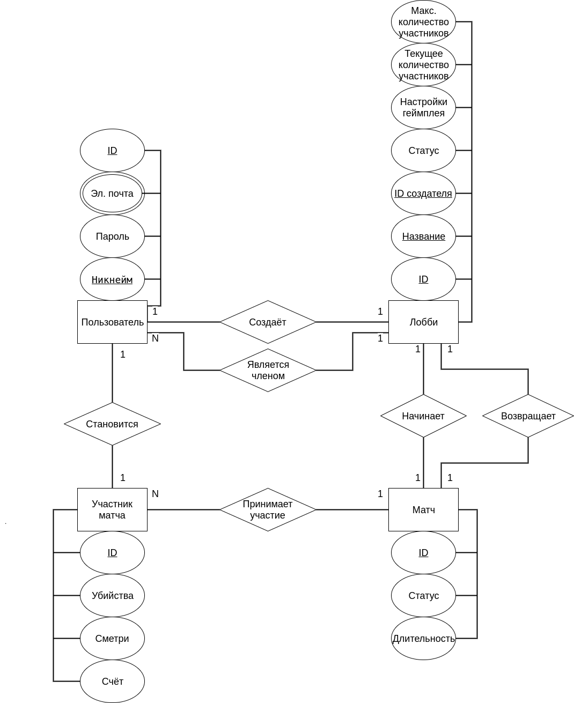

# ShadowShoot The Game

## 1. Цель работы
Реализовать веб-приложение, которое позволит играть в
своеобразный шутер в мультиплеере с друзьями и другими игроками.

## 2. Функциональные требования

1. Работающая мультиплеерная игра в стиле шутер
2. Возможность как создавать свое лобби, так и присоединяться к чужим 
3. Возможность добавления пользователя в свой список друзей
4. Возможность редактирования настроек геймплея в лобби, где пользователь является лидером

## 3. Описание геймплея

Геймплей игры будет сильно похож на уже существующую игру
[Bullet Echo](https://www.bulletecho.game/) только сильно упрощен. Ключевой механикой
будет то, что большинство игрового поля будет в [тумане войны](https://ru.wikipedia.org/wiki/Туман_войны)
и видить пользователь будет только то, что находится в поле зрения его глаз.
Управление персонажем будет производиться от [третьего лица](https://ru.wikipedia.org/wiki/Шутер_от_третьего_лица).
Использование данных механик должно привести к высокому погрудению пользователя в игровой процесс, ведь
не известно есть ли противник за углом или нет. Также оружие будет обладать разбросом.
В первой готовой версии игры будет только режим каждый сам за себя. 

## 4. Стек технологий

HTML, CSS, TypeScript, Pixi, WebSocket, Postgres

## 5. Use-Case диаграмма

## 6. ER-диаграмма сущностей 

